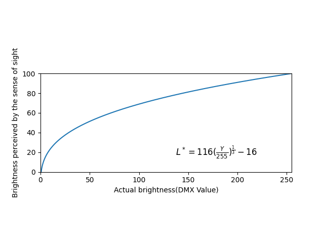

# LED など照明器具と人間か感じる明るさの関係

## 概要

LED 照明等の照明器具の明るさと、人間が実際に感じる明るさの間には差異が生じている。

ここでは、この事について数式などを用いて記述していく。

## 定義

この文章内では、

- 明るさを*L*とする
- 明るさとは、**人間が実際に感じる明るさ**を指す
- 輝度を*Y*とする
- 輝度とは、**LED など照明器具の実際の明るさ(=DMX の値)**を指す
  と定義する。

## CIE による数式化

[CIELAB color space(L*a*b)](https://en.wikipedia.org/wiki/CIELAB_color_space)によると、L と Y の間に以下のような関係があると示されている。

$$L^*  = 116f(\frac{Y}{Y_n})-16$$
ただし、$Y_n$は基準となるホワイトポイントの CIEXYZ での三刺激値を表し、大抵は 100 となる。また$f(t)$は以下の関数で定義される。

$$ f(t) = t^{\frac{1}{3}} (t > (\frac{6}{29})^3 の場合)$$

$$ f(t) = \frac{1}{3}(\frac{29}{6})^2t + \frac{16}{116} (t \leq (\frac{6}{29})^3 の場合)$$

これらの数式から、低輝度( $t\leq\frac{6}{29}$ )の場合には線形補間が行われることが示されているが、それ以外の大多数の領域では $L^*  = 116f(\frac{Y}{Y_n})-16$ の式は $L^*  = 116(\frac{Y}{Y_n})^{\frac{1}{3}}-16$ と表すことができ、Y の $\frac{1}{3}$ 乗に比例する形が支配的であると言える。

## 数式の簡略化

$L^*  = 116(\frac{Y}{Y_n})^{\frac{1}{3}}-16$ の $Y_n$ が大抵 100 となることから、この数式は以下のように簡略化できる。
$$L^*  = 116(\frac{Y}{100})^{\frac{1}{3}}-16$$

しかしながら、実際の DMX 信号などを使用している場合、100%に相当する値は 255 のため、以下のように変更したものを使用することが適切であると考えられる。

$$L^*  = 116(\frac{Y}{255})^{\frac{1}{3}}-16$$

この数式の Y に実際の LED 等の DMX 数値を入れると人間が実際に感じる明るさを計算することができ、逆に$L^*$に実際に人間が感じる明るさ(0~255)を入れることで LED の明るさをどのようにするべきかを計算することが可能である。

